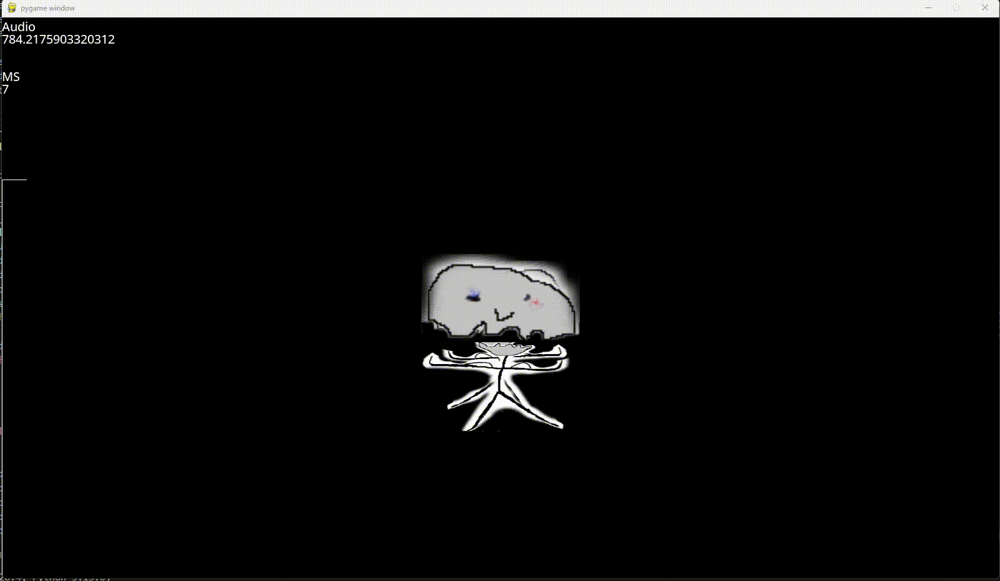

# Install For Windows
- Install C++ Build Tools via VisualStudio.
- Install all packages in requirements.txt

# Description
- Display the base and head images from the images folder onto a cube.obj from models.
- Responds to microphone input to bobble the head.

